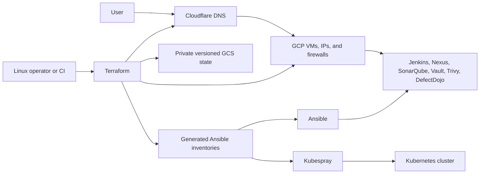

# GCP Terraform, Ansible, and Kubespray Platform

This interview project provisions GCP infrastructure with Terraform, configures
DevOps services with Ansible, and creates a Kubernetes cluster with Kubespray.
It is designed to run from a Linux control machine.

## Architecture



## Repository Layout

- `terraform/infrastructure`: service VMs, firewall rules, DNS, and inventories.
- `terraform/k8s_infrastructure`: GCP VMs and inventory for Kubespray.
- `terraform/ansible_service_config`: first-party service configuration roles.
- `terraform/ansible_kubespray_k8s`: Kubespray integration and vendored upstream.
- `.github/workflows/quality.yml`: Terraform, Ansible, and security checks.

## Linux Prerequisites

Install Terraform, Google Cloud CLI, Ansible, `ansible-lint`, and Git. Create an
SSH key and authenticate with GCP:

```bash
ssh-keygen -t ed25519 -f ~/.ssh/id_ed25519
gcloud auth application-default login
gcloud config set project YOUR_GCP_PROJECT_ID
```

Update the Terraform examples to use `~/.ssh/id_ed25519.pub` and your trusted
public IP CIDR. Never use `0.0.0.0/0` for SSH or the Kubernetes API.

## Run Flow

The service stack already includes a backend config at
`terraform/infrastructure/live/dev/asia-southeast1/gcp-vm/backend.gcs.hcl`.
Create the matching GCS bucket first, then initialize Terraform against it.

1. Authenticate and set your project.

```bash
ssh-keygen -t ed25519 -f ~/.ssh/id_ed25519
gcloud auth application-default login
gcloud config set project YOUR_GCP_PROJECT_ID
```

2. Create the GCS state bucket with the bootstrap stack.

```bash
cd terraform/infrastructure/bootstrap
terraform init
terraform apply -var="project_id=YOUR_GCP_PROJECT_ID"
```

3. Apply the service infrastructure.

```bash
cd terraform/infrastructure/live/dev/asia-southeast1/gcp-vm
cp terraform.tfvars.example terraform.tfvars
terraform init -reconfigure -backend-config=backend.gcs.hcl
terraform plan
terraform apply
```

4. Configure the VM with Ansible.

```bash
cd terraform/ansible_service_config
ansible-galaxy collection install -r collections/requirements.yml
ansible-playbook -i inventories/dev/hosts.ini playbooks/site.yml
```

5. Optional: apply the Kubernetes stack and run Kubespray.

```bash
cd terraform/k8s_infrastructure/live/dev/asia-southeast1/kubespray-k8s
cp terraform.tfvars.example terraform.tfvars
terraform init
terraform apply
cd terraform/ansible_kubespray_k8s/kubespray
ansible-playbook -i inventory/sample/inventory.ini cluster.yml
```

Use distinct backend prefixes for every environment.

## Ansible Secrets

Service files reference encrypted vault variables. Create and encrypt each
required local vault file:

```bash
cd terraform/ansible_service_config
cp group_vars/defectdojo/vault.yml.example group_vars/defectdojo/vault.yml
ansible-vault encrypt group_vars/defectdojo/vault.yml
```

Run playbooks with `--ask-vault-pass` or a protected vault-password mechanism.
Rotate the credentials that existed in earlier Git history before real use.

## Environments

Dev, staging, and production examples are provided. Apply non-dev values with a
separate state prefix:

```bash
cp environments/staging.tfvars.example environments/staging.tfvars
terraform plan -var-file=environments/staging.tfvars
cp environments/prod.tfvars.example environments/prod.tfvars
terraform plan -var-file=environments/prod.tfvars
```

Use separate GCP projects and backend prefixes for strong isolation.

## Validation

```bash
bash terraform/infrastructure/scripts/validate-all.sh
bash terraform/k8s_infrastructure/scripts/validate-all.sh
ansible-lint terraform/ansible_service_config/playbooks terraform/ansible_service_config/roles
```

The manual GitHub apply workflow requires a protected `dev` environment and
these repository or environment secrets:

- `GCP_WORKLOAD_IDENTITY_PROVIDER`
- `GCP_SERVICE_ACCOUNT`
- `GCP_STATE_BUCKET`
- `SERVICES_TFVARS_B64`, containing the service stack's base64-encoded `terraform.tfvars`
- `KUBERNETES_TFVARS_B64`, containing the Kubernetes stack's base64-encoded `terraform.tfvars`

Run each Ansible playbook twice. The second run should report no unexpected
changes; keep that output as idempotency evidence for interviews.

After the first successful Terraform initialization, commit the generated
`.terraform.lock.hcl` files so provider selections remain reproducible.

## Interview Evidence

Keep sanitized evidence of a successful CI run, reviewed Terraform plans,
Ansible first-run and idempotent second-run summaries, service health checks,
and Kubernetes node readiness. Do not include IP addresses, credentials, state,
or other access details.

Estimate cost before every deployment with the GCP pricing calculator. The main
cost drivers are six Kubernetes VMs, two service VMs, persistent disks, and
external IPv4 addresses.

## Operations

- For a fresh setup, follow the Run Flow above.
- Apply service infrastructure after the GCS backend exists: `bash terraform/infrastructure/scripts/apply-dev-and-run-ansible.sh`
- Apply Kubernetes infrastructure: `bash terraform/k8s_infrastructure/scripts/apply-dev-and-run-ansible.sh`
- Recovery guidance: `terraform/infrastructure/docs/disaster-recovery.md`
- Kubespray version policy: `terraform/ansible_kubespray_k8s/KUBESPRAY_DEPENDENCY.md`

Before applying, review the Terraform plan, confirm estimated GCP cost, verify
the backend prefix, and confirm that administrative CIDRs are restricted.

Addtional Note
- terraform {} is used to configure Terraform itself, not the cloud resources.
`Where to store state, Which Terraform version is required, Which provider plugins are required`
- terraform {} = Terraform settings
- provider {}  = cloud/API connection settings
- resource {}  = real things to create
- module {}    = call reusable Terraform code