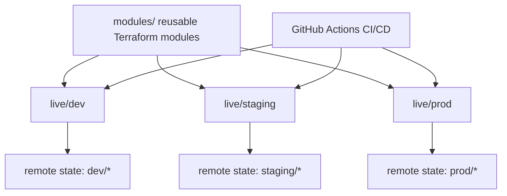
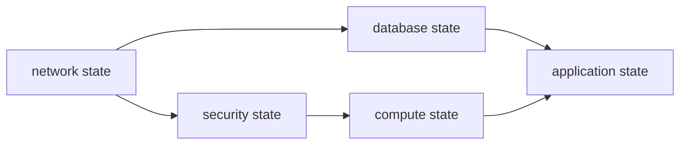

# Terraform Reference Architecture

This guide explains a clean, production-style Terraform architecture. It covers folder layout, reusable modules, environments, remote state, dependency flow, CI/CD, security, and optional Terragrunt usage.

Use this file as a study guide and as a template when designing Terraform infrastructure repositories.

Related notes:

- [Terraform Summary](./terraform-summary.md)
- [Terraform Installation](./terraform-installation.md)
- [Terraform CLI Commands](./terraformCLI-command.md)
- [Terraform Syntax Complete Guide](./Terraform%20syntax%20complete.md)

## Full Structure Diagram

```text
project-root/
|-- infrastructure/
|   |-- README.md
|   |-- .gitignore
|   |
|   |-- .github/
|   |   |-- workflows/
|   |       |-- terraform-plan.yml
|   |       |-- terraform-apply.yml
|   |
|   |-- modules/
|   |   |-- network/
|   |   |   |-- main.tf
|   |   |   |-- variables.tf
|   |   |   |-- outputs.tf
|   |   |   |-- versions.tf
|   |   |   |-- README.md
|   |   |
|   |   |-- gcp-vm/
|   |   |   |-- main.tf
|   |   |   |-- variables.tf
|   |   |   |-- outputs.tf
|   |   |   |-- versions.tf
|   |   |   |-- README.md
|   |   |
|   |   |-- database/
|   |   |-- kubernetes/
|   |
|   |-- live/
|   |   |-- dev/
|   |   |   |-- asia-southeast1/
|   |   |       |-- gcp-vm/
|   |   |       |   |-- backend.tf
|   |   |       |   |-- providers.tf
|   |   |       |   |-- main.tf
|   |   |       |   |-- variables.tf
|   |   |       |   |-- outputs.tf
|   |   |       |   |-- terraform.tfvars
|   |   |
|   |   |-- staging/
|   |   |   |-- asia-southeast1/
|   |   |       |-- gcp-vm/
|   |   |
|   |   |-- prod/
|   |       |-- asia-southeast1/
|   |           |-- gcp-vm/
|   |
|   |-- scripts/
|   |-- docs/
|
|-- ansible/
|   |-- ansible.cfg
|   |-- README.md
|   |
|   |-- inventories/
|   |   |-- dev/
|   |   |   |-- hosts.ini.example
|   |   |-- staging/
|   |   |   |-- hosts.ini.example
|   |   |-- prod/
|   |       |-- hosts.ini.example
|   |
|   |-- group_vars/
|   |   |-- all.yml
|   |
|   |-- collections/
|   |   |-- requirements.yml
|   |
|   |-- playbooks/
|   |   |-- sonarqube.yml
|   |
|   |-- roles/
|       |-- sonarqube/
|           |-- defaults/
|           |-- handlers/
|           |-- tasks/
|           |-- templates/
```

For a Terraform-only repository, you can keep only `infrastructure/`. When using Terraform plus Ansible, place `ansible/` beside `infrastructure/`, not inside a Terraform module.

Terraform creates infrastructure. Ansible configures the server.

```text
Terraform:
  create GCP VM
  create firewall rules
  create database or database network access
  output server IP

Ansible:
  SSH to the server
  install Java
  install PostgreSQL or connect external DB
  install SonarQube
  configure systemd
  start service
```

## Terraform-Only Structure Diagram

```text
infrastructure/
|-- README.md
|-- .gitignore
|
|-- .github/
|   |-- workflows/
|       |-- terraform-plan.yml
|       |-- terraform-apply.yml
|
|-- modules/
|   |-- network/
|   |   |-- main.tf
|   |   |-- variables.tf
|   |   |-- outputs.tf
|   |   |-- versions.tf
|   |   |-- README.md
|   |
|   |-- security-group/
|   |   |-- main.tf
|   |   |-- variables.tf
|   |   |-- outputs.tf
|   |   |-- versions.tf
|   |   |-- README.md
|   |
|   |-- compute/
|   |   |-- main.tf
|   |   |-- variables.tf
|   |   |-- outputs.tf
|   |   |-- versions.tf
|   |   |-- README.md
|   |
|   |-- database/
|   |   |-- main.tf
|   |   |-- variables.tf
|   |   |-- outputs.tf
|   |   |-- versions.tf
|   |   |-- README.md
|   |
|   |-- kubernetes/
|   |   |-- main.tf
|   |   |-- variables.tf
|   |   |-- outputs.tf
|   |   |-- versions.tf
|   |   |-- README.md
|
|-- live/
|   |-- dev/
|   |   |-- us-east-1/
|   |       |-- network/
|   |       |   |-- backend.tf
|   |       |   |-- providers.tf
|   |       |   |-- main.tf
|   |       |   |-- variables.tf
|   |       |   |-- outputs.tf
|   |       |   |-- terraform.tfvars
|   |       |
|   |       |-- security/
|   |       |   |-- backend.tf
|   |       |   |-- providers.tf
|   |       |   |-- main.tf
|   |       |   |-- variables.tf
|   |       |   |-- outputs.tf
|   |       |   |-- terraform.tfvars
|   |       |
|   |       |-- compute/
|   |       |-- database/
|   |       |-- kubernetes/
|   |
|   |-- staging/
|   |   |-- us-east-1/
|   |       |-- network/
|   |       |-- security/
|   |       |-- compute/
|   |       |-- database/
|   |       |-- kubernetes/
|   |
|   |-- prod/
|       |-- us-east-1/
|       |   |-- network/
|       |   |-- security/
|       |   |-- compute/
|       |   |-- database/
|       |   |-- kubernetes/
|       |
|       |-- ap-southeast-1/
|           |-- network/
|           |-- security/
|           |-- compute/
|           |-- database/
|           |-- kubernetes/
|
|-- scripts/
|   |-- check-format.sh
|   |-- plan-all.sh
|   |-- validate-all.sh
|
|-- docs/
|   |-- architecture.md
|   |-- runbook.md
|   |-- disaster-recovery.md
```

High-level flow:



## Applied Example Flow: GCP VM + Ansible SonarQube

This repository now includes a concrete implementation of this architecture for a Terraform + Ansible flow:

```text
terraform/
|-- infrastructure/
|   |-- modules/
|   |   |-- gcp-vm/
|   |       |-- main.tf
|   |       |-- variables.tf
|   |       |-- outputs.tf
|   |       |-- versions.tf
|   |       |-- README.md
|   |
|   |-- live/
|       |-- dev/
|           |-- asia-southeast1/
|               |-- gcp-vm/
|                   |-- backend.tf
|                   |-- providers.tf
|                   |-- main.tf
|                   |-- variables.tf
|                   |-- outputs.tf
|                   |-- terraform.tfvars.example
|
|-- ansible/
|   |-- inventories/
|   |-- group_vars/
|   |-- collections/
|   |-- playbooks/
|   |-- roles/
|       |-- sonarqube/
```

The reusable Terraform module is:

```text
terraform/infrastructure/modules/gcp-vm
```

The dev Terraform deployment root module is:

```text
terraform/infrastructure/live/dev/asia-southeast1/gcp-vm
```

The Ansible SonarQube configuration is:

```text
terraform/ansible/roles/sonarqube
```

Run the Terraform dev flow:

```bash
cd terraform/infrastructure/live/dev/asia-southeast1/gcp-vm
cp terraform.tfvars.example terraform.tfvars
terraform init
terraform plan
terraform apply
terraform output -raw server_ip
```

Then run Ansible:

```bash
cd terraform/ansible
cp inventories/dev/hosts.ini.example inventories/dev/hosts.ini
ansible-galaxy collection install -r collections/requirements.yml
ansible-playbook -i inventories/dev/hosts.ini playbooks/sonarqube.yml
```

PowerShell copy command:

```powershell
Copy-Item terraform.tfvars.example terraform.tfvars
```

## Table of Contents

1. [Architecture Goals](#1-architecture-goals)
2. [Architecture Styles](#2-architecture-styles)
3. [Recommended Repository Layout](#3-recommended-repository-layout)
4. [Core Concepts](#4-core-concepts)
5. [Reusable Modules](#5-reusable-modules)
6. [Live Environment Configuration](#6-live-environment-configuration)
7. [Remote State Architecture](#7-remote-state-architecture)
8. [Dependency Architecture](#8-dependency-architecture)
9. [Provider and Account Architecture](#9-provider-and-account-architecture)
10. [Environment Promotion](#10-environment-promotion)
11. [CI/CD Workflow](#11-cicd-workflow)
12. [Security Architecture](#12-security-architecture)
13. [Testing and Validation](#13-testing-and-validation)
14. [Operations and Disaster Recovery](#14-operations-and-disaster-recovery)
15. [Optional Terragrunt Architecture](#15-optional-terragrunt-architecture)
16. [Adding a New Environment](#16-adding-a-new-environment)
17. [Golden Rules](#17-golden-rules)
18. [Official References](#18-official-references)

## 1. Architecture Goals

A good Terraform architecture should be:

- Reusable: common infrastructure is written once as modules.
- Isolated: dev, staging, and prod do not share the same state file.
- Predictable: changes are reviewed with `terraform plan` before `terraform apply`.
- Secure: secrets are not hardcoded, state is encrypted, and access is controlled.
- Scalable: adding a new environment, region, or service does not require restructuring the repo.
- Team-friendly: CI/CD runs formatting, validation, plan, and controlled apply.
- Recoverable: state files are backed up, locked, and restorable.

Terraform architecture is not only about folders. It is about how code, state, credentials, environments, modules, and deployment workflow connect.

## 2. Architecture Styles

There are several common Terraform repository styles.

### Style 1: Simple Single Project

Best for learning or one small environment.

```text
infrastructure/
|-- main.tf
|-- variables.tf
|-- outputs.tf
|-- providers.tf
|-- versions.tf
|-- terraform.tfvars
```

Pros:

- Easy to understand.
- Fast to start.

Cons:

- Hard to scale.
- Dev and prod can become mixed.
- State can become too large.

### Style 2: Environment Folders

Best for small to medium teams.

```text
infrastructure/
|-- modules/
|   |-- network/
|   |-- compute/
|   |-- database/
|-- environments/
|   |-- dev/
|   |   |-- main.tf
|   |   |-- terraform.tfvars
|   |-- staging/
|   |   |-- main.tf
|   |   |-- terraform.tfvars
|   |-- prod/
|       |-- main.tf
|       |-- terraform.tfvars
```

Pros:

- Easy separation by environment.
- Good for teams learning Terraform.
- Works without extra tools.

Cons:

- Some duplication between environment folders.
- Dependencies must be managed carefully.

### Style 3: Component-Based Live Infrastructure

Best for production.

Each environment, region, and component has its own Terraform root module and state file.

```text
infrastructure/
|-- modules/
|-- live/
|   |-- dev/
|   |   |-- us-east-1/
|   |       |-- network/
|   |       |-- security/
|   |       |-- compute/
|   |       |-- database/
|   |-- prod/
|       |-- us-east-1/
|           |-- network/
|           |-- security/
|           |-- compute/
|           |-- database/
```

Pros:

- Smaller state files.
- Lower blast radius.
- Easier team ownership.
- Easier partial deployment.

Cons:

- More folders.
- Dependencies require clear design.

### Style 4: Terragrunt DRY Architecture

Best when you want less repetition across many accounts, environments, and regions.

Terragrunt is a wrapper around Terraform. It can generate backend/provider config, manage dependencies, and run multiple modules.

Pros:

- Less repeated backend/provider code.
- Good multi-account and multi-region support.
- Helpful dependency management.

Cons:

- Extra tool to learn.
- CI/CD must install both Terraform and Terragrunt.
- Not required for every project.

### Style 5: HCP Terraform Architecture

Best for teams that want managed remote state, remote runs, policy checks, VCS integration, and team access controls.

Pros:

- Managed state and locking.
- Strong collaboration model.
- Remote plans and applies.
- Policy as code support.

Cons:

- Requires HCP Terraform setup.
- Workflow is more platform-based.

## 3. Recommended Repository Layout

This is a strong production layout for Terraform without requiring Terragrunt.

```text
infrastructure/
|-- README.md
|-- .gitignore
|-- .github/
|   |-- workflows/
|       |-- terraform-plan.yml
|       |-- terraform-apply.yml
|
|-- modules/
|   |-- network/
|   |   |-- main.tf
|   |   |-- variables.tf
|   |   |-- outputs.tf
|   |   |-- versions.tf
|   |   |-- README.md
|   |-- security-group/
|   |-- compute/
|   |-- database/
|   |-- kubernetes/
|   |-- sonarqube/
|
|-- live/
|   |-- dev/
|   |   |-- us-east-1/
|   |       |-- network/
|   |       |   |-- backend.tf
|   |       |   |-- providers.tf
|   |       |   |-- main.tf
|   |       |   |-- variables.tf
|   |       |   |-- outputs.tf
|   |       |   |-- terraform.tfvars
|   |       |-- security/
|   |       |-- compute/
|   |       |-- database/
|   |       |-- sonarqube/
|   |
|   |-- staging/
|   |   |-- us-east-1/
|   |       |-- network/
|   |       |-- security/
|   |       |-- compute/
|   |       |-- database/
|   |
|   |-- prod/
|       |-- us-east-1/
|       |   |-- network/
|       |   |-- security/
|       |   |-- compute/
|       |   |-- database/
|       |-- ap-southeast-1/
|           |-- network/
|           |-- security/
|
|-- scripts/
|   |-- check-format.sh
|   |-- plan-all.sh
|
|-- docs/
|   |-- architecture.md
|   |-- runbook.md
```

### Why This Layout Works

`modules/` contains reusable building blocks.

`live/` contains real deployed environments.

Each folder under `live/<env>/<region>/<component>/` is a Terraform root module with its own state file.

Example:

```text
live/prod/us-east-1/network
```

This folder manages only production networking in `us-east-1`.

It should not manage databases, Kubernetes, SonarQube, or unrelated resources.

## 4. Core Concepts

### Root Module

A root module is the directory where you run Terraform.

Example:

```bash
cd live/dev/us-east-1/network
terraform init
terraform plan
terraform apply
```

That folder is a root module.

### Reusable Module

A reusable module is called by a root module.

Example:

```hcl
module "network" {
  source = "../../../../modules/network"

  name       = "dev-us-east-1"
  cidr_block = "10.10.0.0/16"
}
```

### Component

A component is one deployable part of infrastructure.

Examples:

- `network`
- `security`
- `compute`
- `database`
- `kubernetes`
- `sonarqube`
- `monitoring`

### Environment

An environment is a separate deployment target.

Examples:

- `dev`
- `staging`
- `prod`

Use separate state per environment.

### Region

A region is the cloud provider location.

Examples:

- `us-east-1`
- `eu-west-1`
- `ap-southeast-1`

Use separate folders and state per region when possible.

## 5. Reusable Modules

Reusable modules should be generic. They should not know whether they are used in dev, staging, or prod unless the caller passes that value.

### Good Module Structure

```text
modules/network/
|-- main.tf
|-- variables.tf
|-- outputs.tf
|-- versions.tf
|-- README.md
```

### Module Example

`modules/network/variables.tf`

```hcl
variable "name" {
  description = "Name prefix for network resources."
  type        = string
}

variable "cidr_block" {
  description = "VPC CIDR block."
  type        = string
}

variable "availability_zones" {
  description = "Availability zones for subnets."
  type        = list(string)
}

variable "tags" {
  description = "Common tags."
  type        = map(string)
  default     = {}
}
```

`modules/network/main.tf`

```hcl
resource "aws_vpc" "this" {
  cidr_block           = var.cidr_block
  enable_dns_hostnames = true
  enable_dns_support   = true

  tags = merge(var.tags, {
    Name = var.name
  })
}

resource "aws_subnet" "public" {
  for_each = {
    for index, az in var.availability_zones : az => index
  }

  vpc_id                  = aws_vpc.this.id
  availability_zone       = each.key
  cidr_block              = cidrsubnet(var.cidr_block, 8, each.value)
  map_public_ip_on_launch = true

  tags = merge(var.tags, {
    Name = "${var.name}-public-${each.key}"
    Tier = "public"
  })
}
```

`modules/network/outputs.tf`

```hcl
output "vpc_id" {
  description = "VPC ID."
  value       = aws_vpc.this.id
}

output "public_subnet_ids" {
  description = "Public subnet IDs."
  value       = [for subnet in aws_subnet.public : subnet.id]
}
```

### Module Rules

Good modules:

- Have clear inputs and outputs.
- Do not hardcode environment names.
- Do not hardcode account IDs.
- Do not configure remote backend.
- Do not define provider credentials.
- Pin provider requirements in `versions.tf`.
- Include examples and README files.

## 6. Live Environment Configuration

The `live/` folder contains real infrastructure deployments.

Example:

```text
live/dev/us-east-1/network/
|-- backend.tf
|-- providers.tf
|-- main.tf
|-- variables.tf
|-- outputs.tf
|-- terraform.tfvars
```

### backend.tf

```hcl
terraform {
  backend "s3" {
    bucket         = "company-terraform-state"
    key            = "dev/us-east-1/network/terraform.tfstate"
    region         = "us-east-1"
    dynamodb_table = "company-terraform-locks"
    encrypt        = true
  }
}
```

### providers.tf

```hcl
terraform {
  required_version = ">= 1.6.0"

  required_providers {
    aws = {
      source  = "hashicorp/aws"
      version = "~> 5.0"
    }
  }
}

provider "aws" {
  region = var.region

  default_tags {
    tags = var.tags
  }
}
```

### variables.tf

```hcl
variable "region" {
  type        = string
  description = "AWS region."
}

variable "name" {
  type        = string
  description = "Name prefix."
}

variable "vpc_cidr" {
  type        = string
  description = "VPC CIDR block."
}

variable "availability_zones" {
  type        = list(string)
  description = "Availability zones."
}

variable "tags" {
  type        = map(string)
  description = "Common tags."
}
```

### main.tf

```hcl
module "network" {
  source = "../../../../modules/network"

  name               = var.name
  cidr_block         = var.vpc_cidr
  availability_zones = var.availability_zones
  tags               = var.tags
}
```

### terraform.tfvars

```hcl
region = "us-east-1"
name   = "dev-us-east-1"

vpc_cidr = "10.10.0.0/16"

availability_zones = [
  "us-east-1a",
  "us-east-1b",
  "us-east-1c"
]

tags = {
  Project     = "platform"
  Environment = "dev"
  ManagedBy   = "Terraform"
}
```

## 7. Remote State Architecture

Terraform state maps configuration to real infrastructure.

State should be:

- Remote
- Encrypted
- Locked
- Backed up
- Access controlled

### Recommended State Strategy

Use one state file per environment, region, and component.

Good:

```text
dev/us-east-1/network/terraform.tfstate
dev/us-east-1/database/terraform.tfstate
prod/us-east-1/network/terraform.tfstate
prod/us-east-1/database/terraform.tfstate
```

Risky:

```text
all-infrastructure/terraform.tfstate
```

A single huge state file increases blast radius and slows down plans.

### S3 Backend Example

```hcl
terraform {
  backend "s3" {
    bucket         = "company-terraform-state"
    key            = "prod/us-east-1/network/terraform.tfstate"
    region         = "us-east-1"
    dynamodb_table = "company-terraform-locks"
    encrypt        = true
  }
}
```

### HCP Terraform Backend Example

```hcl
terraform {
  cloud {
    organization = "company"

    workspaces {
      name = "prod-us-east-1-network"
    }
  }
}
```

### State Naming Pattern

Use predictable names:

```text
<environment>/<region>/<component>/terraform.tfstate
```

Examples:

```text
dev/us-east-1/network/terraform.tfstate
staging/us-east-1/sonarqube/terraform.tfstate
prod/ap-southeast-1/kubernetes/terraform.tfstate
```

## 8. Dependency Architecture

Components often depend on outputs from other components.

Example:

```text
network -> security -> compute -> application
network -> database -> application
```

### Preferred Dependency Flow



### Option 1: Single Root Composition

For small environments, call all modules from one root module.

```hcl
module "network" {
  source = "../../../modules/network"
}

module "database" {
  source = "../../../modules/database"
  vpc_id = module.network.vpc_id
}
```

Pros:

- Terraform automatically understands dependencies.
- Simple.

Cons:

- One larger state file.
- Higher blast radius.

### Option 2: Remote State Outputs

For component-based architecture, read outputs from another state.

```hcl
data "terraform_remote_state" "network" {
  backend = "s3"

  config = {
    bucket = "company-terraform-state"
    key    = "prod/us-east-1/network/terraform.tfstate"
    region = "us-east-1"
  }
}

module "database" {
  source = "../../../../modules/database"

  vpc_id     = data.terraform_remote_state.network.outputs.vpc_id
  subnet_ids = data.terraform_remote_state.network.outputs.private_subnet_ids
}
```

Pros:

- Keeps state files smaller.
- Components can be deployed independently.

Cons:

- Consumers can read all outputs from the referenced state.
- Dependencies are more manual.
- Apply order matters.

### Option 3: Terragrunt Dependency Blocks

Terragrunt can read dependency outputs for you.

```hcl
dependency "network" {
  config_path = "../network"
}

inputs = {
  vpc_id     = dependency.network.outputs.vpc_id
  subnet_ids = dependency.network.outputs.private_subnet_ids
}
```

Pros:

- Cleaner than repeated `terraform_remote_state`.
- Good for many components.

Cons:

- Requires Terragrunt.

## 9. Provider and Account Architecture

### Single Account Provider

```hcl
provider "aws" {
  region = var.region
}
```

### Multi-Region Provider Aliases

```hcl
provider "aws" {
  region = "us-east-1"
}

provider "aws" {
  alias  = "west"
  region = "us-west-2"
}

module "logs_west" {
  source = "../../../modules/logs"

  providers = {
    aws = aws.west
  }
}
```

### Multi-Account Assume Role

```hcl
provider "aws" {
  region = var.region

  assume_role {
    role_arn = var.role_arn
  }
}
```

### Recommended Account Separation

For production teams:

```text
management account
dev account
staging account
prod account
security/logging account
```

Why:

- Reduces blast radius.
- Separates billing and permissions.
- Makes prod harder to damage accidentally.
- Supports least privilege access.

## 10. Environment Promotion

A strong Terraform workflow promotes the same module version through environments.

```text
dev -> staging -> prod
```

Recommended promotion model:

1. Develop or update a module.
2. Test in `dev`.
3. Pin the module version.
4. Promote the same version to `staging`.
5. Promote the same version to `prod`.

### Module Version Pinning

Registry module:

```hcl
module "vpc" {
  source  = "terraform-aws-modules/vpc/aws"
  version = "5.8.1"
}
```

Git module:

```hcl
module "app" {
  source = "git::https://github.com/company/terraform-modules.git//app?ref=v1.2.0"
}
```

Avoid unpinned branches for production:

```hcl
# Risky for prod
source = "git::https://github.com/company/terraform-modules.git//app?ref=main"
```

## 11. CI/CD Workflow

CI/CD should separate planning from applying.

### Pull Request Workflow

```text
Developer opens PR
CI runs terraform fmt -check
CI runs terraform validate
CI runs terraform plan
Team reviews plan
PR is approved
```

### Merge Workflow

```text
PR merged to main
CI runs terraform plan again
Manual approval for prod
CI runs terraform apply
State is updated remotely
```

### Example GitHub Actions Plan

```yaml
name: Terraform Plan

on:
  pull_request:

jobs:
  plan:
    runs-on: ubuntu-latest

    steps:
      - name: Checkout
        uses: actions/checkout@v4

      - name: Setup Terraform
        uses: hashicorp/setup-terraform@v3

      - name: Terraform Format
        run: terraform fmt -check -recursive

      - name: Terraform Init
        working-directory: live/dev/us-east-1/network
        run: terraform init

      - name: Terraform Validate
        working-directory: live/dev/us-east-1/network
        run: terraform validate

      - name: Terraform Plan
        working-directory: live/dev/us-east-1/network
        run: terraform plan
```

### Example GitHub Actions Apply

```yaml
name: Terraform Apply

on:
  push:
    branches:
      - main

jobs:
  apply:
    runs-on: ubuntu-latest
    environment: production

    steps:
      - name: Checkout
        uses: actions/checkout@v4

      - name: Setup Terraform
        uses: hashicorp/setup-terraform@v3

      - name: Terraform Init
        working-directory: live/prod/us-east-1/network
        run: terraform init

      - name: Terraform Plan
        working-directory: live/prod/us-east-1/network
        run: terraform plan -out=tfplan

      - name: Terraform Apply
        working-directory: live/prod/us-east-1/network
        run: terraform apply -auto-approve tfplan
```

## 12. Security Architecture

### Do Not Hardcode Secrets

Avoid:

```hcl
password = "SuperSecret123"
```

Better:

```hcl
variable "db_password" {
  type      = string
  sensitive = true
}
```

Even sensitive values can still exist in Terraform state. Protect the state backend carefully.

### State Security

State can contain:

- Passwords
- Tokens
- Resource IDs
- IP addresses
- Database endpoints
- Generated secrets

Protect state with:

- Encryption at rest.
- Limited IAM access.
- State locking.
- Versioning.
- Audit logs.

### Secrets Manager Pattern

Prefer storing secrets in a secrets manager.

```hcl
data "aws_secretsmanager_secret_version" "db" {
  secret_id = "prod/database/password"
}
```

Use the secret value carefully because it may still enter state depending on how resources consume it.

### Least Privilege for CI/CD

CI/CD should use a role with only the permissions needed for that environment.

Example:

```text
github-actions-dev-role
github-actions-staging-role
github-actions-prod-role
```

Prod role should require stronger approval.

### Network Security

Common production pattern:

```text
Internet
  |
Load Balancer
  |
Private Application Subnets
  |
Private Database Subnets
```

Avoid putting databases directly in public subnets.

## 13. Testing and Validation

### Local Checks

```bash
terraform fmt -recursive
terraform validate
terraform plan
```

### Automated Checks

Recommended CI checks:

- `terraform fmt -check -recursive`
- `terraform validate`
- `terraform plan`
- `terraform test`
- Security scanning with tools such as Checkov, tfsec, or Terrascan

### Terraform Tests

Example:

```hcl
run "valid_plan" {
  command = plan

  assert {
    condition     = var.environment != ""
    error_message = "Environment cannot be empty."
  }
}
```

Run:

```bash
terraform test
```

## 14. Operations and Disaster Recovery

### Useful Commands

```bash
terraform state list
terraform state show aws_instance.web
terraform output
terraform plan -refresh-only
terraform apply -refresh-only
terraform state pull
```

### Backup State

```bash
terraform state pull > backup.tfstate
```

### Restore State

Use with care:

```bash
terraform state push backup.tfstate
```

### Unlock State

Only unlock if you are sure no Terraform job is running.

```bash
terraform force-unlock LOCK_ID
```

### Drift Detection

Infrastructure drift happens when someone changes resources outside Terraform.

Detection:

```bash
terraform plan -refresh-only
```

Prevention:

- Restrict console access.
- Use CI/CD for changes.
- Run scheduled plans.
- Alert on drift.

## 15. Optional Terragrunt Architecture

Terragrunt helps reduce repeated Terraform code in large multi-account systems.

### Terragrunt Layout

```text
infrastructure/
|-- terragrunt.hcl
|-- modules/
|   |-- network/
|   |-- database/
|   |-- kubernetes/
|-- config/
|   |-- common.yaml
|   |-- dev.yaml
|   |-- staging.yaml
|   |-- prod.yaml
|-- accounts/
|   |-- dev/
|   |   |-- account.hcl
|   |   |-- us-east-1/
|   |       |-- region.hcl
|   |       |-- network/
|   |       |   |-- terragrunt.hcl
|   |       |-- database/
|   |           |-- terragrunt.hcl
|   |-- prod/
|       |-- account.hcl
|       |-- us-east-1/
|           |-- region.hcl
|           |-- network/
|           |-- database/
```

### Root terragrunt.hcl

```hcl
locals {
  account_vars = read_terragrunt_config(find_in_parent_folders("account.hcl"))
  region_vars  = read_terragrunt_config(find_in_parent_folders("region.hcl"))

  environment = local.account_vars.locals.environment
  account_id  = local.account_vars.locals.account_id
  region      = local.region_vars.locals.region
}

remote_state {
  backend = "s3"

  config = {
    bucket         = "company-terraform-state"
    key            = "${path_relative_to_include()}/terraform.tfstate"
    region         = "us-east-1"
    dynamodb_table = "company-terraform-locks"
    encrypt        = true
  }
}

generate "provider" {
  path      = "provider.tf"
  if_exists = "overwrite_terragrunt"

  contents = <<EOF
provider "aws" {
  region = "${local.region}"

  assume_role {
    role_arn = "arn:aws:iam::${local.account_id}:role/TerraformDeployRole"
  }

  default_tags {
    tags = {
      Environment = "${local.environment}"
      ManagedBy   = "Terraform"
    }
  }
}
EOF
}
```

### account.hcl

```hcl
locals {
  environment = "dev"
  account_id  = "111111111111"
}
```

### region.hcl

```hcl
locals {
  region             = "us-east-1"
  availability_zones = ["us-east-1a", "us-east-1b", "us-east-1c"]
}
```

### Component terragrunt.hcl

```hcl
include "root" {
  path = find_in_parent_folders()
}

terraform {
  source = "../../../../modules/network"
}

inputs = {
  name               = "dev-us-east-1"
  cidr_block         = "10.10.0.0/16"
  availability_zones = ["us-east-1a", "us-east-1b", "us-east-1c"]
}
```

### Terragrunt Dependency Example

```hcl
include "root" {
  path = find_in_parent_folders()
}

terraform {
  source = "../../../../modules/database"
}

dependency "network" {
  config_path = "../network"
}

inputs = {
  vpc_id     = dependency.network.outputs.vpc_id
  subnet_ids = dependency.network.outputs.private_subnet_ids
}
```

### Terragrunt Commands

```bash
terragrunt init
terragrunt plan
terragrunt apply
terragrunt run-all plan
terragrunt run-all apply
```

Use Terragrunt when the benefits are worth the extra tool. Plain Terraform is enough for many teams.

## 16. Adding a New Environment

For the recommended plain Terraform layout:

```bash
mkdir -p live/uat/us-east-1/network
cp live/staging/us-east-1/network/*.tf live/uat/us-east-1/network/
cp live/staging/us-east-1/network/terraform.tfvars live/uat/us-east-1/network/
```

Then edit:

```text
live/uat/us-east-1/network/backend.tf
live/uat/us-east-1/network/terraform.tfvars
```

Change:

- Backend state key
- Environment tag
- CIDR ranges
- Instance sizes
- Feature flags
- Account or role settings

Run:

```bash
cd live/uat/us-east-1/network
terraform init
terraform plan
terraform apply
```

## 17. Golden Rules

| Rule | Why It Matters |
| --- | --- |
| Use remote state | Local state is unsafe for teams. |
| One state per component | Smaller blast radius and faster plans. |
| Keep modules reusable | Modules should not hardcode dev, staging, or prod. |
| Pin provider versions | Prevents surprise behavior changes. |
| Review every plan | Plan is your infrastructure change report. |
| Do not store secrets in Git | Secrets should come from secure systems. |
| Protect Terraform state | State can contain sensitive data. |
| Use CI/CD for prod | Reduces human error and creates audit history. |
| Separate prod from dev | Account and state separation reduce risk. |
| Prefer for_each for named resources | Stable keys reduce accidental replacement. |
| Avoid huge root modules | Large state increases blast radius. |
| Document inputs and outputs | Makes modules easier to reuse. |
| Test modules | Catch problems before infrastructure changes. |

## 18. Official References

- Terraform Language: https://developer.hashicorp.com/terraform/language
- Terraform Modules: https://developer.hashicorp.com/terraform/language/modules
- Terraform State: https://developer.hashicorp.com/terraform/language/state
- Terraform Backends: https://developer.hashicorp.com/terraform/language/backend
- S3 Backend: https://developer.hashicorp.com/terraform/language/settings/backends/s3
- HCP Terraform: https://developer.hashicorp.com/terraform/cloud-docs
- Terraform Tests: https://developer.hashicorp.com/terraform/language/tests
- Terraform CLI Commands: https://developer.hashicorp.com/terraform/cli/commands
- Terragrunt Documentation: https://terragrunt.gruntwork.io/docs/
